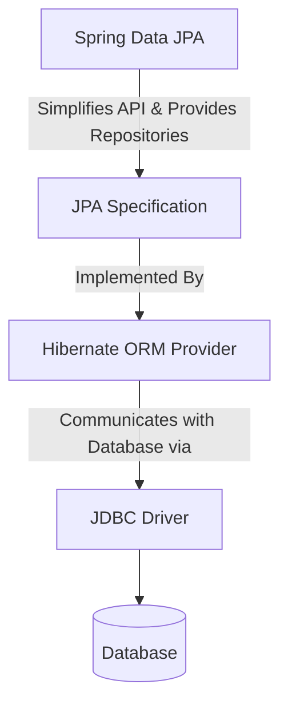

# Employee Management System - Hibernate-Specific Features

This project demonstrates the implementation and benefits of using **Hibernate-specific features** to optimize application performance and customize entity mappings.

---

## 1. Differences Between JPA, Hibernate & Spring Data JPA

Understanding the relationship and differences between JPA, Hibernate, and Spring Data JPA is essential for effective database integration in Java.

| Feature / Aspect | JPA (Java Persistence API) | Hibernate | Spring Data JPA |
| :--- | :--- | :--- | :--- |
| **Role / Type** | **Specification** (Standard) | **ORM Provider** (Implementation) | **Data Access Abstraction** (Library) |
| **What it is** | A set of interfaces, rules, and guidelines defined under Jakarta/Java EE for Object-Relational Mapping. | A concrete library that implements the JPA specification, plus additional vendor-specific features. | A framework layer built on top of JPA to dramatically reduce boilerplate code for data access. |
| **Key Classes/Interfaces**| `EntityManager`, `EntityManagerFactory`, `EntityTransaction`, `@Entity`, `@Table`, `@Id` | `Session`, `SessionFactory`, `Transaction`, `@DynamicUpdate`, `@Formula`, `@CreationTimestamp` | `JpaRepository`, `CrudRepository`, `@Repository`, `Pageable`, `Sort` |
| **Execution** | Cannot run on its own; it requires an implementation (ORM provider) to do the actual database work. | Can run independently as a JPA provider or as a standalone Hibernate native API engine. | Requires a JPA provider (typically Hibernate) underneath to execute actual database commands. |
| **Primary Benefit** | Standardizes code, enabling portability across different JPA providers (e.g., EclipseLink, OpenJPA). | Provides rich custom annotations, caching (L2 Cache), batching capabilities, and query tuning. | Eliminates CRUD boilerplate via dynamic query methods (e.g., `findByDepartment`) and interfaces. |

### Visual Relationship


---

## 2. Spring Data JPA Quick Example

Spring Data JPA allows you to define repositories by simply writing interface declarations:

### 1. Entity Definition
```java
package com.example.entity;

import javax.persistence.*;

@Entity
@Table(name = "employees")
public class Employee {
    @Id
    @GeneratedValue(strategy = GenerationType.IDENTITY)
    private Long id;
    
    private String name;
    private String department;
    private Double salary;

    // Getters, setters, constructors
}
```

### 2. Repository Interface
By extending `JpaRepository`, Spring Data JPA automatically provides standard CRUD methods (like `save`, `findById`, `findAll`, `deleteById`) and supports query creation from method names!
```java
package com.example.repository;

import com.example.entity.Employee;
import org.springframework.data.jpa.repository.JpaRepository;
import java.util.List;

public interface EmployeeRepository extends JpaRepository<Employee, Long> {
    // Dynamic Query Method: Automatically translated to JPQL by Spring Data JPA
    List<Employee> findByDepartment(String department);
    
    // Customized query using JPQL
    @Query("SELECT e FROM Employee e WHERE e.salary > :minSalary")
    List<Employee> findHighEarners(@Param("minSalary") Double minSalary);
}
```

### 3. Service Usage
```java
package com.example.service;

import com.example.entity.Employee;
import com.example.repository.EmployeeRepository;
import org.springframework.beans.factory.annotation.Autowired;
import org.springframework.stereotype.Service;
import java.util.List;

@Service
public class EmployeeService {

    @Autowired
    private EmployeeRepository employeeRepository;

    public Employee createEmployee(Employee employee) {
        return employeeRepository.save(employee); // No Session, Transaction, or EntityManager boilerplate!
    }

    public List<Employee> getEmployeesByDept(String dept) {
        return employeeRepository.findByDepartment(dept);
    }
}
```

---

## 3. Hibernate-Specific Features Implemented in This Project

In this project, we bypass JPA generalities to configure and utilize **Hibernate-specific mapping and performance features**:

### A. Hibernate-Specific Annotations (on `Employee` Entity)
1. **`@DynamicInsert`**: Instructs Hibernate to generate the SQL `INSERT` statement dynamically, excluding columns with `null` values. This leverages database default column values and avoids inserting unnecessary nulls.
2. **`@DynamicUpdate`**: Instructs Hibernate to generate the SQL `UPDATE` statement dynamically, including *only* columns that have actually changed. This reduces database write overhead, especially for columns/tables with LOB fields or complex indexes.
3. **`@Formula("salary * 12")`**: Evaluates read-only property calculations at the database level during the SQL fetch (`SELECT`), rather than doing Java-side arithmetic.
4. **`@CreationTimestamp` & `@UpdateTimestamp`**: Automatically saves and updates database audit columns (`created_at` and `updated_at`) whenever a record is created or updated.

### B. Hibernate Configuration Settings (`hibernate.cfg.xml`)
- **`dialect`**: Set to `org.hibernate.dialect.H2Dialect` for optimal H2 schema generation and query translations.
- **`hibernate.jdbc.batch_size`**: Configured to `50`, telling Hibernate to buffer up to 50 insertions/updates into a single batch network call instead of sending them individually.
- **`hibernate.order_inserts` & `hibernate.order_updates`**: Ensures Hibernate sorts insert/update statements so that batching is executed sequentially without breaking JDBC batches.
- **`hibernate.generate_statistics`**: Enables profiling to verify transaction boundaries and trace database roundtrips.

### C. Batch Processing & Memory Optimization (in `App.java`)
Standard batch inserts can cause `OutOfMemoryError` in Hibernate because all persisted entities remain stored in the session's first-level cache. 
The application solves this by flushing and clearing the session memory periodically:
```java
int batchSize = 50;
for (int i = 1; i <= 120; i++) {
    Employee emp = new Employee("BatchEmp_" + i, "IT_Dept", 3000.0 + (i * 10));
    session.save(emp);

    if (i % batchSize == 0) {
        session.flush(); // Sends queued insert queries to H2 in a single batch
        session.clear(); // Clears memory cache to prevent OutOfMemory issues
    }
}
```

---

## 4. Building and Running the Application

### Option A: Using Maven Command Line (If Installed)
From the root workspace directory, you can build and run using:
```bash
# Build the project
mvn clean install

# Execute the main driver application
mvn exec:java -pl week2/EmployeeManagementSystem -Dexec.mainClass="com.employee.App"
```

### Option B: Running in IDE (Visual Studio Code / IntelliJ IDEA)
1. Open the workspace in your IDE.
2. Navigate to [App.java](file:///c:/luffy/LPUU/Projects/Cognizant/week2/EmployeeManagementSystem/src/main/java/com/employee/App.java).
3. Click **Run** or right-click and select **Run Java Application**.
4. Observe the formatted SQL queries in the console to inspect dynamic insertions, dynamic updates, and statistics tracking!
