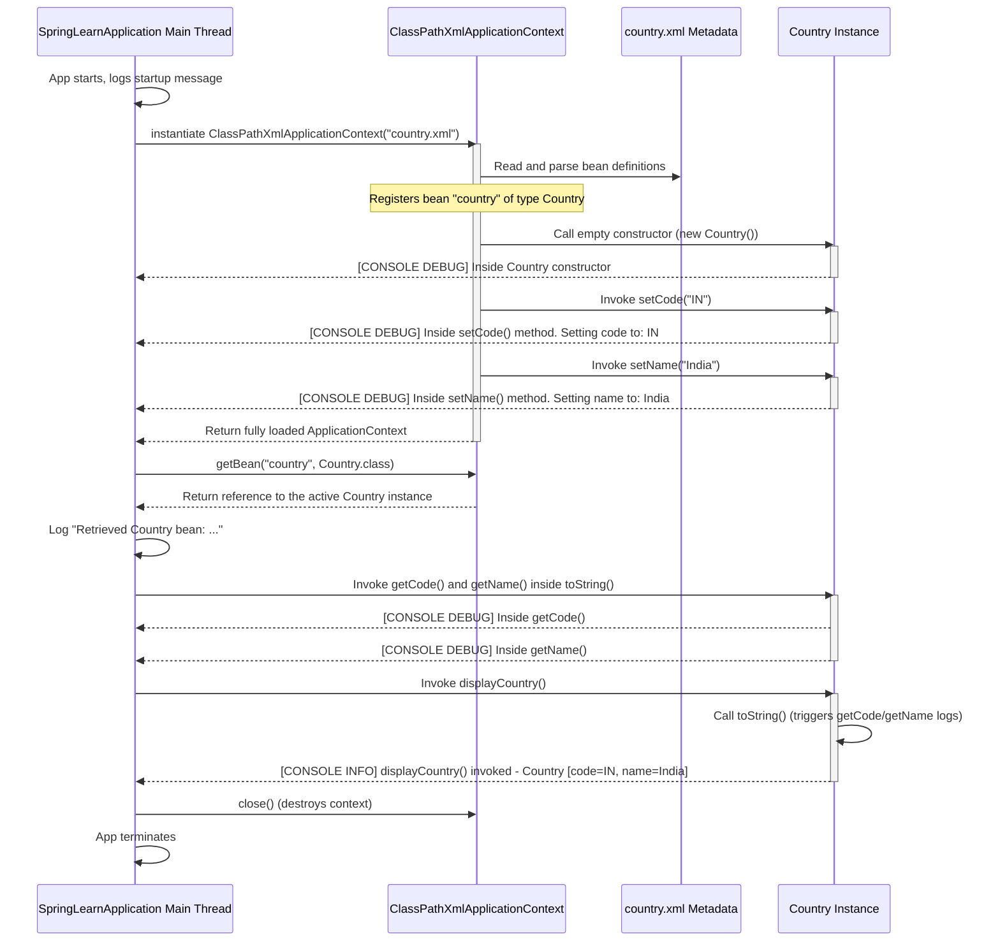

# Spring Core – Load Country from Spring Configuration XML

## Project Overview
This project is part of the **Cognizant Digital Nurture (DN) 5.0 Deep Skilling** program. It serves as an introductory, hands-on assignment for Spring Framework Core concepts. The project demonstrates how to configure and load a simple Spring Bean (`Country`) from an external XML configuration file (`country.xml`) using the classical `ClassPathXmlApplicationContext` container.

---

## Objective
The primary objective of this assignment is to:
1. Understand the core building blocks of the Spring Framework (IoC container, Beans, Dependency Injection).
2. Configure a Spring bean using XML-based configuration (`country.xml`).
3. Instantiate and load the Spring container (`ApplicationContext`) dynamically at runtime.
4. Retrieve the bean programmatically and verify how the IoC container handles instantiation and property population using Setter Injection (demonstrated via debug logging statements).

---

## Problem Statement
In traditional Java applications, managing object creation, dependency mapping, and configuration was tightly coupled to the application code. For example, if a client class required a `Country` object, it had to manually instantiate it using `new Country()`. If the configuration or the data changed, developers had to modify the code, recompile, and redeploy.

In enterprise software, this manual wiring leads to:
*   **Tight coupling** between components.
*   **Difficulty in unit testing** (since dependencies cannot be easily mocked).
*   **Monolithic designs** that are hard to scale and maintain.

We need a clean way to separate object creation and configuration from the business logic.

---

## Why Spring Framework?
Spring Framework exists to solve the complexities of enterprise Java development. It is built on the philosophy of **POJO-based programming** (Plain Old Java Objects), which allows developers to build robust systems using lightweight classes. Spring provides:
1.  **Loose Coupling:** By delegating object creation to the container, classes depend on interfaces or abstract definitions instead of concrete implementations.
2.  **Declarative Services:** Spring handles cross-cutting concerns like transactions, security, and logging behind the scenes using Aspect-Oriented Programming (AOP).
3.  **Non-invasive Framework:** Business logic remains free of framework-specific APIs, making it highly portable.
4.  **Exceptional Ecosystem Integration:** Seamless integrations with JDBC, Hibernate, JPA, JMS, and various frontend technologies.

---

## What is Dependency Injection?
**Dependency Injection (DI)** is a design pattern that implements Inversion of Control. It is the process of passing dependencies (objects that another object needs to function) into an object rather than letting the object create them itself.

### Real-Life Analogy:
Think of a **Car** and an **Engine**:
*   **Without DI:** The Car builds its own Engine inside its constructor (`this.engine = new V8Engine()`). If you want to change the engine to an `ElectricEngine`, you must modify the Car class code.
*   **With DI:** The Engine is manufactured separately. When the Car is assembled, the factory "injects" the Engine into the Car (either via the constructor or a setter). The Car doesn't care how the Engine was built, as long as it fits the interface.

In Spring, DI is typically achieved via two main methods:
1.  **Constructor Injection:** Dependencies are provided through the constructor arguments. Used for mandatory dependencies.
2.  **Setter Injection:** Dependencies are provided via public setter methods. Used for optional or mutable dependencies (which we are using in this project).

---

## What is IoC (Inversion of Control)?
**Inversion of Control (IoC)** is a broader software design principle where the control flow of a program is inverted. Instead of the application programmer controlling the lifecycle of objects and execution flow, an external framework or container takes over that responsibility.

*   **Traditional Flow:** Your code controls when classes are instantiated, when methods are called, and in what order.
*   **Inverted Flow (IoC):** The container instantiates your classes, injects their dependencies, manages their lifecycle, and calls your code based on external configuration.

---

## What is a Bean?
In Spring, a **Bean** is simply an object that is instantiated, assembled, and managed by the Spring IoC container. Beans are the backbone of any Spring application. They are normal Java objects (usually POJOs) that are registered in the Spring configuration metadata (XML or annotations).

---

## What is ApplicationContext?
`ApplicationContext` is the advanced Spring IoC container interface. It extends `BeanFactory` (which provides basic configuration and bean instantiation features) and adds enterprise-focused features:
*   Easy integration with Spring's AOP features.
*   Message resource handling (for internationalization/i18n).
*   Event publication mechanism.
*   Application-layer specific contexts (such as `WebApplicationContext`).

### Internal Architecture & How it Works:
1.  **Configuration Metadata Input:** The container reads configuration metadata (XML files, Java annotations, or Java configuration classes).
2.  **Bean Definition Parsing:** The container parses this metadata and registers internal `BeanDefinition` objects representing each bean's properties, constructor arguments, and dependency references.
3.  **Instantiation and Injection:** When initialized (e.g., during container startup for singletons), the container uses Java Reflection API to instantiate the beans, perform dependency injection, and apply lifecycle callbacks.
4.  **Registry Lookup:** The container holds these fully configured bean instances in an internal map (a registry). When `context.getBean()` is called, Spring retrieves the bean directly from this registry.

---

## What is ClassPathXmlApplicationContext?
`ClassPathXmlApplicationContext` is a concrete implementation of the `ApplicationContext` interface. It loads context definitions from an XML configuration file located on the application's classpath (such as `src/main/resources`). It is particularly useful for classical standalone Java applications.

---

## Why XML Configuration?
Before Spring 3.0 and Spring Boot popularized annotations (`@Component`, `@Autowired`) and Java Config (`@Configuration`), Spring configurations were defined entirely in XML files.
*   **Separation of Concerns:** Configurations were kept completely separate from Java source code, ensuring zero compile-time dependencies on config details.
*   **Centralized Overview:** All beans and wiring in the application were declared in a single or few XML files, making it easy to see the complete application dependency graph at a glance.
*   **No Code Recompilation:** Changes to bean values (e.g. changing database credentials or bean class implementations) could be made by editing the XML file directly without recompiling Java source code.

---

## Project Structure
The project structure is organized as a clean Maven module:

```text
spring-learn-xml/
 ├── pom.xml                                           # Maven Project Configuration
 └── src/
     └── main/
         ├── java/                                     # Java source directory
         │   └── com/cognizant/springlearn/
         │       ├── Country.java                      # Domain Class (Bean)
         │       └── SpringLearnApplication.java        # Main Bootstrap class
         └── resources/                                # Configurations and assets
             ├── country.xml                           # Spring XML Configuration file
             ├── application.properties                 # Basic application properties
             └── logback.xml                           # Logger configuration to enable DEBUG level
```

---

## Code Explanation

### 1. [pom.xml](file:///C:/luffy/LPUU/Projects/Cognizant/week3/spring-learn-xml/pom.xml)
This file defines Maven metadata and project dependencies:
*   **`<parent>`**: Inherits from our workspace root pom to keep multi-module configurations consistent.
*   **`spring-context`**: Pulls in the entire core Spring framework capability (`spring-core`, `spring-beans`, `spring-aop`, `spring-expression`).
*   **`slf4j-api`** and **`logback-classic`**: Integrates the standard logging facade and engine to support enterprise-grade logging.
*   **`exec-maven-plugin`**: Configured to make execution simple via CLI using `mvn exec:java`.

### 2. [Country.java](file:///C:/luffy/LPUU/Projects/Cognizant/week3/spring-learn-xml/src/main/java/com/cognizant/springlearn/Country.java)
A simple POJO class representing a country:
*   **Constructor:** The empty default constructor contains a `LOGGER.debug()` statement. It proves that Spring creates the object using reflection by calling the zero-argument constructor.
*   **Setters (`setCode`, `setName`):** Both contain `LOGGER.debug()` statements. When Spring reads `<property name="code" value="IN"/>`, it invokes `setCode("IN")` on the created object. These logs prove that Setter Injection is occurring.
*   **Getters (`getCode`, `getName`):** Contain debug logs tracking property read access.
*   **`toString()`**: Overridden to return a clean string representation of the object state: `Country [code=..., name=...]`.
*   **`displayCountry()`**: Prints the country configuration details using `LOGGER.info()`.

### 3. [country.xml](file:///C:/luffy/LPUU/Projects/Cognizant/week3/spring-learn-xml/src/main/resources/country.xml)
The XML configuration defining Spring Beans:
*   **`<beans>`**: Root container namespace declaration.
*   **`<bean id="country" class="com.cognizant.springlearn.Country">`**: Registers a bean named `country` instantiated from the `com.cognizant.springlearn.Country` class. By default, Spring beans are **singletons** (one shared instance created per container).
*   **`<property name="code" value="IN" />`**: Instructs Spring to invoke the `setCode()` setter with a value of `"IN"`.
*   **`<property name="name" value="India" />`**: Instructs Spring to invoke the `setName()` setter with a value of `"India"`.

### 4. [SpringLearnApplication.java](file:///C:/luffy/LPUU/Projects/Cognizant/week3/spring-learn-xml/src/main/java/com/cognizant/springlearn/SpringLearnApplication.java)
The main driver class of our application:
*   `new ClassPathXmlApplicationContext("country.xml")`: Creates a new instance of the Spring IoC container, instructing it to load and parse `country.xml` from the classpath.
*   `context.getBean("country", Country.class)`: Queries the container registry for a bean with the ID `"country"` and casts it safely to the `Country` class.
*   `LOGGER.info(...)`: Displays the retrieved bean's toString representation.
*   `country.displayCountry()`: Invokes the custom method to output values via logging.
*   `context.close()`: Explicitly shuts down the container, triggering proper cleanup and bean destruction routines.

### 5. [logback.xml](file:///C:/luffy/LPUU/Projects/Cognizant/week3/spring-learn-xml/src/main/resources/logback.xml)
Configures log levels. Because the assignment demands debug logging inside getters, setters, and constructors, we configure the custom logger `<logger name="com.cognizant.springlearn" level="DEBUG" />`. This ensures `LOGGER.debug()` statements are visible in the console, while general spring logs remain at the cleaner `INFO` level.

---

## Execution Flow
Here is the step-by-step sequence of events that occurs when running `SpringLearnApplication`:



---

## Bean Lifecycle
The lifecycle of the `Country` singleton bean in this application is managed fully by the Spring IoC container:

1.  **Loading Configuration:** The container loads `country.xml` from the classpath.
2.  **Bean Instantiation:** The container instantiates the bean class `Country` using the default zero-argument constructor (we see the constructor log here).
3.  **Property Population (Setter Injection):** The container injects the configured property values `code` and `name` using setters (we see the setter logs here).
4.  **Post-Initialization Callbacks:** (If defined, e.g., `@PostConstruct` or `InitializingBean` implementation), these callbacks run.
5.  **Bean Ready for Use:** The bean is now stored in the registry, ready to be retrieved via `context.getBean()`.
6.  **Destruction:** When `context.close()` is called, destruction callbacks (if defined, e.g. `@PreDestroy` or `DisposableBean` implementation) are executed, and references are removed.

---

## Output
When the application is run, the console output will match the following format exactly:

```text
2026-06-30 22:00:00 [main] INFO  com.cognizant.springlearn.SpringLearnApplication - Starting SpringLearnApplication (XML-based context)...
2026-06-30 22:00:00 [main] INFO  org.springframework.context.support.ClassPathXmlApplicationContext - Refreshing org.springframework.context.support.ClassPathXmlApplicationContext@568db2f2
2026-06-30 22:00:00 [main] DEBUG com.cognizant.springlearn.Country - Inside Country constructor: Bean instantiation started.
2026-06-30 22:00:00 [main] DEBUG com.cognizant.springlearn.Country - Inside setCode() method. Setting code to: IN
2026-06-30 22:00:00 [main] DEBUG com.cognizant.springlearn.Country - Inside setName() method. Setting name to: India
2026-06-30 22:00:00 [main] DEBUG com.cognizant.springlearn.Country - Inside getCode() method. Current code: IN
2026-06-30 22:00:00 [main] DEBUG com.cognizant.springlearn.Country - Inside getName() method. Current name: India
2026-06-30 22:00:00 [main] INFO  com.cognizant.springlearn.SpringLearnApplication - Retrieved Country bean: Country [code=IN, name=India]
2026-06-30 22:00:00 [main] DEBUG com.cognizant.springlearn.Country - Inside getCode() method. Current code: IN
2026-06-30 22:00:00 [main] DEBUG com.cognizant.springlearn.Country - Inside getName() method. Current name: India
2026-06-30 22:00:00 [main] INFO  com.cognizant.springlearn.Country - displayCountry() invoked - Country [code=IN, name=India]
2026-06-30 22:00:00 [main] INFO  org.springframework.context.support.ClassPathXmlApplicationContext - Closing org.springframework.context.support.ClassPathXmlApplicationContext@568db2f2
2026-06-30 22:00:00 [main] INFO  com.cognizant.springlearn.SpringLearnApplication - SpringLearnApplication execution completed.
```

---

## Concepts Learned
By completing this assignment, the following Spring concepts are covered and consolidated:
*   **IoC Container Initialization:** Creating and instantiating `ApplicationContext` manually via `ClassPathXmlApplicationContext`.
*   **XML Configuration Syntax:** How `<bean>` tags define object graphs and `<property>` tags specify dependencies.
*   **Setter Dependency Injection:** How Spring leverages reflection to call set methods to populate properties at startup.
*   **Singleton Scope:** Understanding that bean creation happens instantly when the container refreshes.
*   **Logging Integration:** Setting up Logback configurations to selectively display debug logs for tracking object state changes.

---

## Common Beginner Mistakes
1.  **Forgetting default constructor:** Spring needs a default empty constructor to instantiate objects when using XML or standard config without custom constructors. If you only provide a parameterized constructor, Spring will throw `BeanCreationException` or `NoSuchMethodException`.
2.  **Incorrect paths for XML:** Placing `country.xml` in an incorrect directory structure (e.g. directly in the project root instead of `src/main/resources`). This results in `FileNotFoundException`.
3.  **Typos in Property Names:** Typo in property tag (e.g., `<property name="cde" value="IN"/>`). Spring uses property names to resolve setters. A typo will cause `InvalidPropertyException`.
4.  **Not closing the Context:** Forgetting to close the ApplicationContext. In larger systems, this can lead to memory and resource leaks.
5.  **Logging Levels:** Expecting `DEBUG` logs to print on standard configurations without specifying logging configurations like `logback.xml` or custom application properties.

---

## Frequently Asked Viva Questions

### 1. What is the Spring IoC container?
The Spring IoC (Inversion of Control) container is the core engine of the Spring Framework. It is responsible for instantiating, configuring, assembly, and managing the lifecycle of Spring beans.

### 2. Explain the difference between BeanFactory and ApplicationContext.
*   **BeanFactory** provides basic configuration management and bean instantiation on-demand (lazy loading). It is lightweight and suitable for resource-constrained environments.
*   **ApplicationContext** extends BeanFactory, providing advanced features like eager loading of singletons, i18n support, application events, and integration with AOP.

### 3. How does Spring instantiate a bean when configuration is XML-based?
Spring reads the XML, parses the `<bean>` tag, finds the class name, uses the Java Reflection API to instantiate the class via its zero-argument constructor, and then injects properties using public setter methods.

### 4. What is Dependency Injection (DI)?
DI is a software design pattern where objects do not create their dependencies. Instead, dependencies are "injected" or supplied to them by an external assembler or container (Spring).

### 5. What are the types of Dependency Injection in Spring?
The two main types are:
1.  **Constructor Injection** (injected through constructor parameters).
2.  **Setter Injection** (injected through public setter methods).
Other types include Field Injection, though it is generally discouraged in modern development.

### 6. When would you prefer Setter Injection over Constructor Injection?
Setter Injection is preferred for optional or mutable dependencies. It allows dependencies to be changed or injected later. For mandatory dependencies, Constructor Injection is preferred to enforce object immutability and completeness.

### 7. What does the `<property>` tag in `country.xml` do?
The `<property>` tag is used to perform Setter Injection. It instructs the Spring container to invoke the corresponding setter method (e.g., `setCode()` for `name="code"`) with the specified value.

### 8. What happens if a class does not have an empty constructor and we use XML bean definition?
If no constructor arguments are defined in the XML `<bean>` tag via `<constructor-arg>`, Spring will attempt to call the empty constructor. If it is missing, Spring will throw a `BeanCreationException` caused by a `NoSuchMethodException`.

### 9. What is a Singleton Bean in Spring?
It is the default scope of a Spring bean. Only one instance of the bean is created per Spring IoC container, and all requests for that bean ID return the same shared instance.

### 10. How do you load multiple XML configuration files in ApplicationContext?
You can pass an array of string config paths to the constructor:
`new ClassPathXmlApplicationContext(new String[]{"config1.xml", "config2.xml"});`
Or import them inside a master XML using `<import resource="config2.xml"/>`.

### 11. What is the role of ClassPathXmlApplicationContext?
It is a container implementation that reads configuration data from XML files located on the application classpath (inside compilation output folder or JAR resources).

### 12. How do you shut down a Spring container gracefully?
By calling the `close()` method on the application context or registering a shutdown hook using `context.registerShutdownHook()`.

### 13. What is the difference between `@Component` and `<bean>`?
*   `@Component` is an annotation used for classpath scanning. It automatically registers the annotated class as a bean.
*   `<bean>` is an XML element used to manually define a bean, allowing you to configure classes whose source code you cannot modify (like third-party libraries).

### 14. What are the key lifecycle phases of a Spring Bean?
Instantiation → Populating properties (Dependency Injection) → Aware interfaces resolution → BeanPostProcessor pre-initialization → Initialization callbacks (like `@PostConstruct` or `afterPropertiesSet()`) → BeanPostProcessor post-initialization → Ready for use → Destruction callbacks.

### 15. What are the benefits of logging frameworks over System.out.println()?
Logging frameworks support log levels (DEBUG, INFO, WARN, ERROR), logs destination routing (file, console, database), custom output formatting, and asynchronous logging. They can also be turned on/off dynamically via configuration without code changes.

### 16. What is the default log level of Spring Boot?
The default log level is `INFO`.

### 17. How can we enable debug logs for our custom package?
By adding `logging.level.your.package=DEBUG` in `application.properties`, or by configuring a custom logback configuration file (`logback.xml`) specifying the logger level.

### 18. What exception is thrown if Spring cannot find the specified XML file on classpath?
It throws a `BeanDefinitionStoreException` caused by a `FileNotFoundException`.

### 19. Can we define multiple beans of the same class type in a single XML file?
Yes. You can define multiple `<bean>` tags of the same class type, provided they have unique `id` or `name` attributes.

### 20. What is the purpose of overriding `toString()` in Spring beans?
It allows developers to easily print and verify the state of bean instances during runtime debugging or when using loggers.

---

## Key Takeaways
1.  **XML is declarative:** It allows changing bean properties without compiling source code.
2.  **Setters are called after constructor:** The instantiation happens first, and only then is the setter executed to inject dependencies.
3.  **Logging reveals the lifecycle:** By adding debug logs to the constructor and setters, we can verify the exact sequence of initialization events.
4.  **Container manages cleanup:** Instantiating the container properly and closing it ensures resource integrity.

---

## Build and Run Instructions

### Prerequisites
*   Java Development Kit (JDK) 17 or 21
*   Apache Maven 3.6+

### 1. Build the Module
Open your terminal at the parent directory or the module directory (`week3/spring-learn-xml`) and compile:
```bash
mvn clean compile
```

### 2. Run the Application
Run the project using the Exec Maven Plugin:
```bash
mvn exec:java
```
Or run directly from your IDE by executing `com.cognizant.springlearn.SpringLearnApplication`'s `main()` method.
