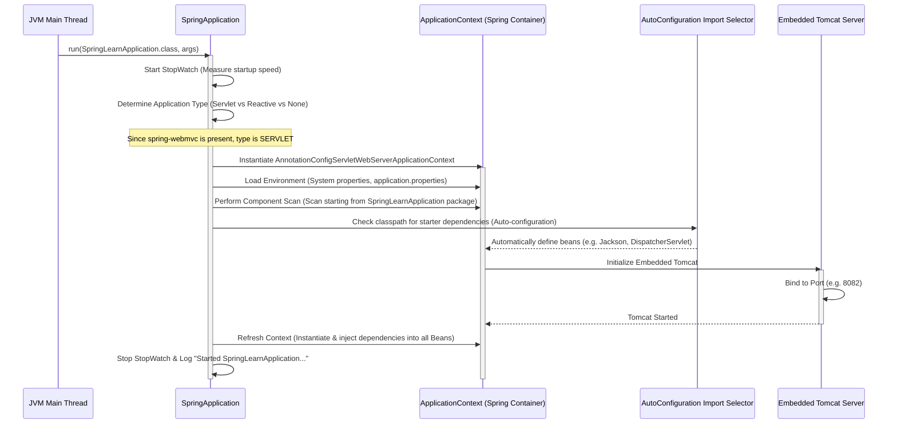

# Deep Dive: Spring Boot Core & Architecture
Welcome to your self-paced Spring Boot learning guide! This document is designed to teach you every core concept, architectural detail, and file role in your `spring-learn` application.

---

## Table of Contents
1. [The Maven Project Structure & Configuration](#1-the-maven-project-structure--configuration)
2. [Configuration with `application.properties`](#2-configuration-with-applicationproperties)
3. [The Entry Point: `SpringLearnApplication`](#3-the-entry-point-springlearnapplication)
4. [Deep Dive: `@SpringBootApplication` Annotation](#4-deep-dive-springbootapplication-annotation)
5. [The Spring Boot Startup Process (Internal Flow)](#5-the-spring-boot-startup-process-internal-flow)
6. [How Embedded Tomcat Works](#6-how-embedded-tomcat-works)
7. [Spring MVC & REST Controller Architecture](#7-spring-mvc--rest-controller-architecture)
8. [How to Run and Test the Application](#8-how-to-run-and-test-the-application)

---

## 1. The Maven Project Structure & Configuration

Maven projects follow a standard directory layout (**Convention over Configuration**). Here is what each folder and file does:

```text
spring-learn/
 ├── pom.xml                                 # Maven Project Object Model (Dependencies & Plugins)
 └── src/
     ├── main/
     │   ├── java/                           # Production Java Source Files
     │   │   └── com/cognizant/springlearn/
     │   │       ├── SpringLearnApplication.java  # App Entry Point
     │   │       └── controller/
     │   │           └── HelloController.java     # REST Controller
     │   └── resources/                      # Configuration files, templates, assets
     │       └── application.properties       # App properties configurations
     └── test/                               # Testing Source Files
```

### Explaining `pom.xml` Key Elements
*   **`<parent>`**: We inherit from `spring-boot-starter-parent`. This acts as a centralized dependency manager. It defines versions for all standard Spring Boot dependencies (Starters) so that you don't have to specify `<version>` tags for each library manually. It prevents version mismatch conflicts.
*   **`spring-boot-starter-web`**: The core dependency for web apps. It pulls in:
    *   **Spring Web MVC** (for mapping HTTP requests).
    *   **Jackson** (for JSON serialization/deserialization).
    *   **Embedded Tomcat** (the web server).
*   **`spring-boot-devtools`**: Speeds up development. When it detects compile changes, it restarts the application context automatically (excluding the classloader that loads third-party JARs, making it very fast).
*   **`spring-boot-maven-plugin`**: Repackages compiled class files into a **"fat JAR"** or **"uber JAR"** that contains all dependencies and the embedded web server, allowing the app to run with a single `java -jar` command.

---

## 2. Configuration with `application.properties`

The `application.properties` file located in `src/main/resources/` externalizes application configuration. 

### Why do we use it?
It allows you to change settings (database URLs, passwords, server ports, logging styles) without modifying Java code. During startup, Spring Boot automatically detects this file and binds properties to the environment.

### Properties used in this project:
*   `server.port=8082`: Changes the server port from the default `8080` to `8082`.
*   `spring.application.name=spring-learn`: Sets the logical name of your application.
*   `logging.level.com.cognizant.springlearn=DEBUG`: Adjusts log levels to display fine-grained debugging info for your packages.

---

## 3. The Entry Point: `SpringLearnApplication`

Our main application class is [SpringLearnApplication.java](file:///C:/luffy/LPUU/Projects/Cognizant/week3/spring-learn/src/main/java/com/cognizant/springlearn/SpringLearnApplication.java):

```java
@SpringBootApplication
public class SpringLearnApplication {
    public static void main(String[] args) {
        SpringApplication.run(SpringLearnApplication.class, args);
    }
}
```

### Why do we do this?
Standard Java Virtual Machine (JVM) applications require a `public static void main(String[] args)` method to run. We call `SpringApplication.run()` to start the entire Spring Framework container context, compile auto-configurations, instantiate classes, and start Tomcat.

---

## 4. Deep Dive: `@SpringBootApplication` Annotation

The `@SpringBootApplication` annotation is a **composed annotation** (or meta-annotation). It is a shorthand wrapper for three essential annotations:

1.  **`@SpringBootConfiguration`** (which inherits from `@Configuration`):
    *   **What it does:** Marks the class as a configuration class capable of defining bean creation methods (using `@Bean`).
    *   **Why it's needed:** Tells Spring that this class is the source of application configuration.
2.  **`@EnableAutoConfiguration`**:
    *   **What it does:** Tells Spring Boot to automatically configure Spring beans based on the JAR dependencies present on the classpath.
    *   **Why it's needed:** If Spring Boot finds `spring-webmvc` on the classpath, it automatically configures a dispatcher servlet, a template resolver, and Jackson serialization beans.
3.  **`@ComponentScan`**:
    *   **What it does:** Scans the package of the annotated class (and all sub-packages) for classes annotated with stereotypes like `@Component`, `@Service`, `@Repository`, or `@RestController`.
    *   **Why it's needed:** Tells Spring to register these classes as Spring Beans in the Application Context.

---

## 5. The Spring Boot Startup Process (Internal Flow)

When you execute `SpringApplication.run(SpringLearnApplication.class, args)`, the following events happen internally:



### Breakdown of Internal Steps:
1.  **Application Type Detection**: Spring Boot inspects the classpath. If it finds servlet-related classes (from `spring-web`), it configures a servlet environment.
2.  **Environment Setup**: Reads system properties, environment variables, and configurations from `application.properties`.
3.  **ApplicationContext Creation**: Instantiates the Spring Container (`AnnotationConfigServletWebServerApplicationContext`).
4.  **Auto-Configuration Execution**: Resolves which starter components should be loaded.
5.  **Embedded Container Setup**: Initializes Tomcat and sets up the Servlet Context.
6.  **Context Refresh**: Instantiates and wires (injects) all dependency-injected components.

---

## 6. How Embedded Tomcat Works

In traditional Java Web development:
*   You wrote your code, compiled it into a **WAR (Web Application Archive)** file.
*   You downloaded, installed, and configured a standalone servlet container (like Apache Tomcat, WildFly, or Glassfish).
*   You deployed the WAR into the webapps directory of that server.

In Spring Boot (**Embedded Tomcat** model):
*   Tomcat is imported as a standard library dependency (compiled JARs inside `spring-boot-starter-web`).
*   During startup, Spring Boot programmatically instantiates the Tomcat engine using Java API (`new Tomcat()`).
*   Spring Boot configures the server, binds it to the specified port (`server.port`), configures thread pools, registers the `DispatcherServlet`, and starts Tomcat programmatically.
*   **Result:** You run your web application like a regular Java program, eliminating the need to configure standalone application servers!

---

## 7. Spring MVC & REST Controller Architecture

Our REST endpoints are defined in [HelloController.java](file:///C:/luffy/LPUU/Projects/Cognizant/week3/spring-learn/src/main/java/com/cognizant/springlearn/controller/HelloController.java).

### Annotations Explained
*   **`@RestController`**:
    *   This is a composed annotation made of `@Controller` and `@ResponseBody`.
    *   **`@Controller`**: Tells Spring that this class acts as a web controller handling HTTP requests.
    *   **`@ResponseBody`**: Instructs Spring that the return value of controller methods should be bound directly to the HTTP response body. Instead of looking for a view template (like HTML/JSP), it writes the response string or serializes the returned Java Object directly into JSON.
*   **`@GetMapping("/hello")`**:
    *   Maps HTTP `GET` requests sent to `/hello` to this method.
*   **`@RequestParam`**:
    *   Binds HTTP request query parameters (e.g., `?name=John`) directly to Java method parameters.

### HTTP Request Processing Lifecycle:
1.  **Request Arrival**: A client sends a `GET` request to `http://localhost:8082/info?name=Nishant`.
2.  **DispatcherServlet Router**: Tomcat forwards the request to Spring's centralized servlet: `DispatcherServlet`.
3.  **Handler Mapping**: `DispatcherServlet` searches registered controllers and finds `HelloController` matching `/info`.
4.  **Controller Invocation**: The controller method `getInfo("Nishant")` is executed, returning a Java `Map`.
5.  **JSON Conversion**: Because of `@ResponseBody`, Spring's Message Converter (`MappingJackson2HttpMessageConverter`) serializes the Java `Map` into a JSON string:
    ```json
    {
      "message": "Spring Boot is awesome!",
      "learnerName": "Nishant",
      "status": "Active",
      "week": 3
    }
    ```
6.  **Response Delivery**: Tomcat writes the JSON to the HTTP response stream back to the client.

---

## 8. How to Run and Test the Application

### 1. Compile the Application
Run this from the project root directory (`week3/spring-learn`):
```bash
mvn clean compile
```

### 2. Run the Application
Run using the Spring Boot plugin:
```bash
mvn spring-boot:run
```

### 3. Verify in Browser or Curl
Access these URLs to test:
*   **Greeting Endpoint**: [http://localhost:8082/hello](http://localhost:8082/hello)
*   **Info (JSON) Endpoint**: [http://localhost:8082/info?name=Nishant](http://localhost:8082/info?name=Nishant)
